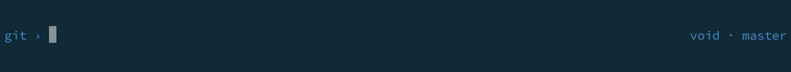

# Void zsh theme

Minimalistic zsh prompt theme.


## Features

  - Status code
  - Current path (basename)

## Git features



  - Git branch
  - Git prompt and aliases (VOID_GIT_PROMPT=1)

```
git › vim git-prompt.sh
git › add .
git › commit -m 'Update aliases'
...
git › push
git › type push
push is an alias for git push -u origin 
```

Aliases are dynamically set up and tear down when entering a git project.

That's it.

## Install

### Manual

- Clone this repository
- source void.zsh-theme

### Antigen

- antigen theme desyncr/void

